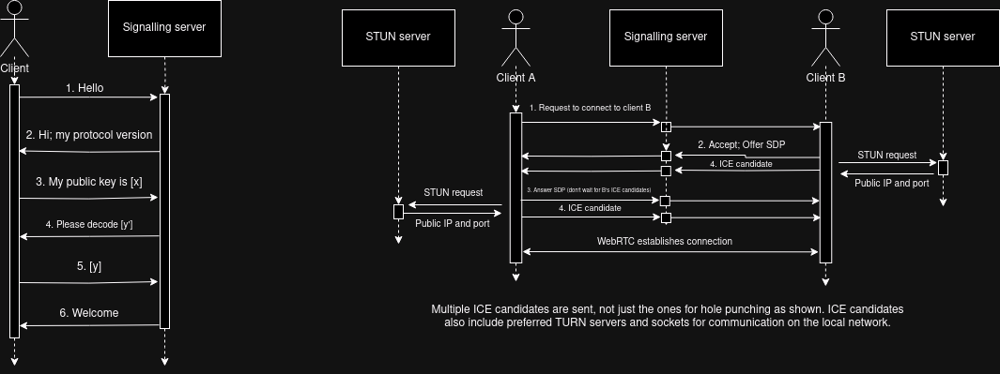

# Basic plan

Main characteristics:

- Centralized matchmaking server
- Peer-to-peer connections where possible
- Desktop UI
- Direct communication only (no group chat)
- Public keys act as usernames - so that we don't need to store any data on the server

Definitions:
- **Online**: The user has an open Websocket connection to the signalling server
- **Friend**: User B is a friend of user A if user B is on the friend list in user A's client (not necessarily mutual)
- **Peer Connection**: A WebRTC connection between 2 users.
- **Connect** (to a user): Open a peer connection to that using the signalling server

## Signalling server

- Users request to come online by providing their public key
    - Users have to prove ownership of the key to prevent impersonation (e.g. signalling server sends a message encrypted with the public key; the user must send it back unencrypted)
- Maintains a Websocket connection to all online users
- Can forward specific messages to other connected users
    - Connection requests, SDPs, ICE candidates,...

## TURN server

> This is a specific protocol that WebRTC uses for relaying when a direct P2P connection is not possible. 

We can run our own private server.

However, I don't think there's any way to prevent the clients from choosing their own TURN server.

## Client

- Attempt to connect to all online friends on startup
    > If a friend comes online when the user's client has already started, then that friend initiates the peer connection instead (provided they are mutual friends)
- Should also periodically attempt to connect to friends in case of connection dropouts/failed connections/etc
- Maintains a friend list
    - Users can add friends manually
        > Once a friend is added the client attempts to connect to the friend
- Receive connection requests
    - If the connect-ee is a friend, the request is accepted automatically
    - If the connect-ee is not a friend, the user sees an incoming friend request, and on accept, the connectee is added to the user's friend list
- Send/receive plaintext messages to/from connected friends
- Display a list of friends and whether they are connected P2P, via a TURN server, or not connected

## Sequence diagram

## Legal Considerations

If we were to make this public, we would definitely need to consult with a legal expert about this. But for the time being, here's ChatGPT:

<blockquote>
I'm looking to make a peer-to-peer messaging service. This is the basic design:

[the above document]

In the UK, what legal considerations would there be for this project?
</blockquote>

Reply:

The bit about Lawful interception could be impossible with fully peer-to-peer messaging :/ 

<blockquote>
Developing a peer-to-peer (P2P) messaging service in the UK involves several legal considerations, which can be broadly categorized into data protection and privacy, security, lawful interception, and other general regulatory compliance. Here's an overview of these considerations:

### 1. Data Protection and Privacy

#### General Data Protection Regulation (GDPR)

- Data Handling: Even though the service is designed to minimize data storage on the server, any personal data processing (e.g., public keys, IP addresses) must comply with GDPR.
- Consent: Explicit consent from users must be obtained for any data processing activities.
- Data Minimization: Ensure only necessary data is collected and processed.
- Security: Implement appropriate technical and organizational measures to protect data.
- Rights of Individuals: Provide mechanisms for users to exercise their rights (e.g., right to access, right to erasure).

#### Data Protection Act 2018 (DPA 2018)

The DPA 2018 supplements GDPR in the UK, emphasizing compliance with data protection principles and rights of data subjects.

### 2. Security
#### Cybersecurity

- Secure Communication: Ensure end-to-end encryption for messages to protect confidentiality.
- Authentication: Robust mechanisms to verify the ownership of public keys and prevent impersonation.
- Vulnerability Management: Regularly update and patch the software to address security vulnerabilities.

### 3. Lawful Interception
#### Investigatory Powers Act 2016 (IPA 2016)

- The IPA 2016 allows government authorities to access communications data under certain conditions.
- Data Retention: You may be required to retain certain types of data for a specified period.
- Interception Capabilities: You may need to implement capabilities to assist with lawful interception requests.

### 4. Other Regulatory Compliance
#### E-Privacy Directive (Privacy and Electronic Communications Regulations - PECR)

- Ensure compliance with PECR for electronic communications, including marketing communications and use of cookies or similar technologies.

#### Terms of Service and Privacy Policy

- Transparency: Clearly outline how data is processed, stored, and shared in your privacy policy.
- User Agreements: Ensure users agree to terms of service that cover acceptable use, data handling practices, and dispute resolution.

#### Intellectual Property

- Ensure no infringement on third-party intellectual property rights (e.g., using open-source software correctly and complying with licenses).

### 5. Specific Use Cases

- Age Verification: If targeting children or minors, implement age verification and parental consent mechanisms where necessary.
- International Users: Consider compliance with data protection laws in other jurisdictions if the service has users outside the UK.

### Steps to Ensure Compliance

- Legal Consultation: Engage with a legal expert specializing in technology and data protection law.
- Data Protection Impact Assessment (DPIA): Conduct a DPIA to identify and mitigate data protection risks.
- Security Audits: Perform regular security audits and penetration testing.
- User Education: Inform users about security practices and privacy settings to enhance overall security.

By addressing these legal considerations, you can ensure that your P2P messaging service is compliant with UK regulations and provides a secure and privacy-respecting environment for users.
</blockquote>

